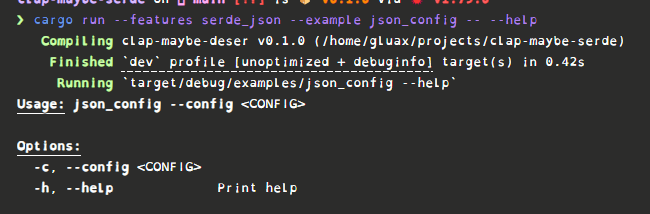
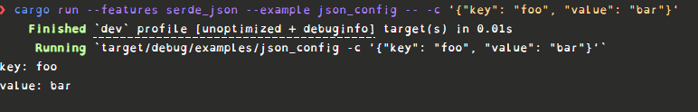
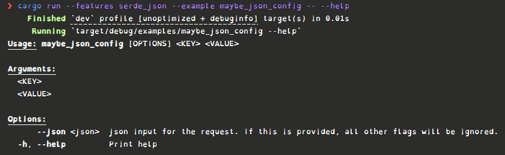
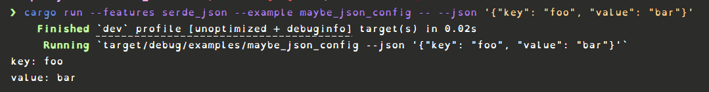
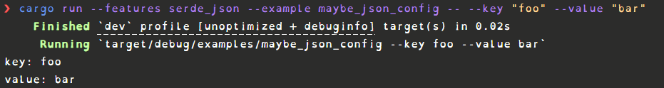
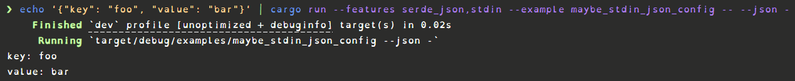
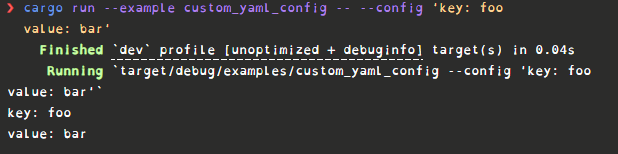

# clap-maybe-deser

Provides wrapper types to allow:
- Parse `serde` deserializable objects as a flag via the `Deser` type for `clap`.
- You can also have your app parse either the flags or the deserializable object by using the `MaybeDeser` type.
- And with the `MaybeStdinDeser` type you can do the above, but the deserializable object can come from `stdin` via the `clap-stdin` crate.
- Also exposes the `CustomDeserializer` trait so you can implement with your own `Deserialize` type.

[](https://crates.io/crates/clap-maybe-deser)
[](https://docs.rs/clap-maybe-deser)

## Usage

### `Deser`

To parse a serde deserializable object as a flag:
```rust
// You can run this example with: ` cargo run --features serde_json --example json_config --`
use clap::Parser;
use clap_maybe_deser::{Deser, JsonDeserializer};
use serde::Deserialize;

#[derive(Deserialize, Debug, Clone)]
struct Config {
    key:   String,
    value: String,
}

#[derive(Parser, Debug)]
struct Cli {
    #[clap(long, short)]
    config: Deser<Config, JsonDeserializer>,
}

fn main() {
    let args = Cli::parse();
    println!("key: {}", args.config.data.key);
    println!("value: {}", args.config.data.value);
}

```

The help output looks like:


The usage for the CLI looks like:



### `MaybeDeser`

To parse as either flags or a deserializable string:

```rust
// You can run this example with: ` cargo run --features serde_json --example maybe_json_config --`
use clap::{Args, Parser};
use clap_maybe_deser::{JsonDeserializer, MaybeDeser};
use serde::Deserialize;

#[derive(Args, Deserialize, Debug, Clone)]
struct Config {
    #[clap(long, short)]
    key:   String,
    #[clap(long, short)]
    value: String,
}

#[derive(Parser, Debug)]
struct Cli {
    #[clap(flatten)]
    config: MaybeDeser<Config, JsonDeserializer>,
}

fn main() {
    let args = Cli::parse();
    println!("key: {}", args.config.data.key);
    println!("value: {}", args.config.data.value);
}
```

The help output looks like:


The usage passing json looks like:


The usage passing flags looks like:



### `MaybeStdinDeser`

To parse a deserializable string from stdin, as a flag for the deserializable string or flags:

```rust
// You can run this example with: `cargo run --features serde_json,stdin --example maybe_stdin_json_config --`
use clap::{Args, Parser};
use clap_maybe_deser::{JsonDeserializer, MaybeStdinDeser};
use serde::Deserialize;

#[derive(Args, Deserialize, Debug, Clone)]
struct Config {
    #[clap(long, short)]
    key:   String,
    #[clap(long, short)]
    value: String,
}

#[derive(Parser, Debug)]
struct Cli {
    #[clap(flatten)]
    config: MaybeStdinDeser<Config, JsonDeserializer>,
}

fn main() {
    let args = Cli::parse();
    println!("key: {}", args.config.data.key);
    println!("value: {}", args.config.data.value);
}
```

The output and usage methods are the exact same as `MaybeDeser` but now you could also pass in the `JSON` from `stdin`:



### Custom Implmentations

To support whatever Deserialize friendly implementation you want you can do:

```rust
// You can run this example with: `cargo run --example custom_yaml_config --`
use clap::Parser;
use clap_maybe_deser::{CustomDeserializer, Deser};
use serde::{de::DeserializeOwned, Deserialize};

#[derive(Debug, Clone)]
struct YamlDeserializer;

impl CustomDeserializer for YamlDeserializer {
    type Error = serde_yml::Error;

    const NAME: &'static str = "yaml";

    fn from_str<Data: DeserializeOwned>(s: &str) -> Result<Data, Self::Error> {
        serde_yml::from_str(s)
    }
}

#[derive(Deserialize, Debug, Clone)]
struct Config {
    key:   String,
    value: String,
}

#[derive(Parser, Debug)]
struct Cli {
    #[clap(long, short)]
    config: Deser<Config, YamlDeserializer>,
}

fn main() {
    let args = Cli::parse();
    println!("key: {}", args.config.data.key);
    println!("value: {}", args.config.data.value);
}

```

You can see this in action as well:



## TODO's

- [ ] Support more serde crates out of the box.
- [ ] Dynamic naming of the flag for `MaybeDeser` and `MaybeStdinDeser`.
- [ ] Add support for also reading from a File via `clap-stdin`'s `FileOrStdin`.

## Licensing

This project is licensed under both the MIT License and the Apache 2.0 License. See the LICENSE-MIT and LICENSE-APACHE files for details.

This project includes dependencies that are licensed under permissive licenses:

- `clap`: [MIT License or Apache 2.0 License](https://github.com/clap-rs/clap/blob/master/LICENSE-MIT)
- `clap-stdin`: [MIT License or Apache 2.0 License](https://github.com/thepacketgeek/clap-stdin/blob/main/LICENSE-MIT)
- `serde`: [MIT License or Apache 2.0 License](https://github.com/serde-rs/serde/blob/master/LICENSE-MIT)
- `serde_json`: [MIT License or Apache 2.0 License](https://github.com/serde-rs/json/blob/master/LICENSE-MIT)
